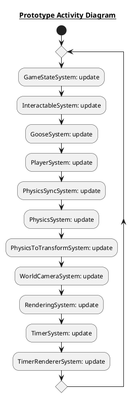
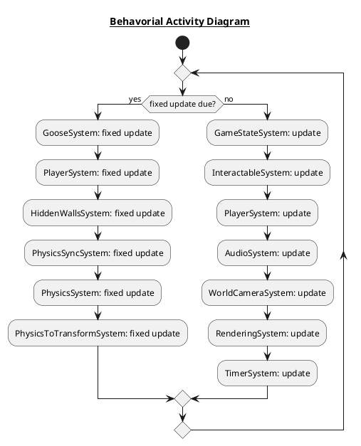
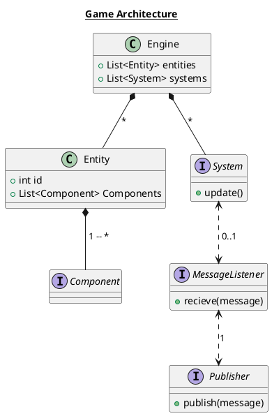
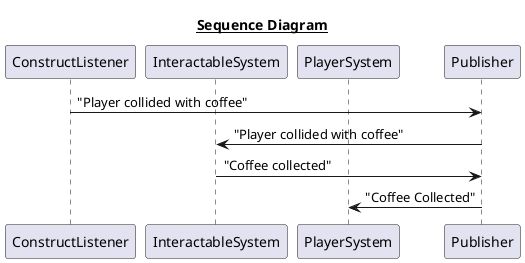

```plantuml
@startuml architectureStructuralDiagram

title __Structural Diagram__


entity Player{
    + int id
}

entity Coffee{
    + int id
}

entity Goose{
    + int id
}

entity CheckInCode{
    + int id
}

entity Timer{
    + int id
}

entity Walls{
    int id
}

entity HiddenWalls{
    int id
}

entity PressurePlate{
    int id
}


class CameraFollowComponent{
    + boolean active
    + Vector2 offset
}

class PhysicsComponent{
    + Body body
    + enum ColliderType
    - ColliderType colliderType
    - float colliderWidth
    - colliderHeight
    - float colliderWidth
    - float colliderHeight
    - float colliderRadius
    - Vector2 colliderOffset
}

class PlayerComponent{
    + final float maxSpeed
    + List<SpeedBonus> speedBonuses
    + final float acceleration
    + final foat deceleration
    + final float knockbackRecovery
    + Vector2 currentKnockback
    + Vector2 naturalVelocity
    + enum PlayerState
    + PlayerState currentState
    

}

class SpriteComponent{
    + Texture texture
    + boolean isShown
    + RenderLayer randerLayer
    + Vector2 textureOffset
    + Vector2 size

}

class TransformComponent{
    + Vector2 position
    + Vector2 scale
}

class GooseComponent{
    + GooseState state
    + float chaseSpeed
    + float retreatSpeed
    + float wanderSpeed
    + float wanderRadius
    + float wanderAcceptDistance
    + Vector2 currentWanderWaypoint
    + float detectionRadius
    + float forgetRadius
    + float retreatTime
    + float retreatTimeElapsed
    + Vector2 homePosition

}

class InteractableComponent{
    + InteractableMessage activationMessage
    + boolean disappearOnInteract
    + boolean interactionEnabled
}

class TimerComponent{
    + float timeRemaining
    + float totalTime
    + boolean isRunning
    + boolean hasExpried

}

class HiddenWallsComponent{
    + String triggeredBy
}

class AnimationComponent{
    + Hash Map<typeOfState, Animation<TextureRegion>> animations
    + typeOfState currentState
    + float elapsed
    + TextureRegion currentFrame
}

class AudioListenerComponent{
    + Vector2 offet
}


Player *-- PlayerComponent
Player *-- PhysicsComponent
Player *-- SpriteComponent
Player *-- TransformComponent
Player *-- CameraFollowComponent
Player *-- AnimationComponent
Player *-- AudioListenerComponent

Coffee *-- InteractableComponent
Coffee *-- TransformComponent
Coffee *-- PhysicsComponent

Goose *-- InteractableComponent
Goose *-- GooseComponent
Goose *-- PhysicsComponent
Goose *-- TransformComponent
Goose *-- AnimationComponent

Timer *-- TimerComponent

CheckInCode *-- InteractableComponent
CheckInCode *-- TransformComponent
CheckInCode *-- PhysicsComponent

Walls *-- PhysicsComponent
Walls *-- TransformComponent

PressurePlate *-- InteractableComponent
PressurePlate *-- TransformComponent

HiddenWalls *-- PhysicsComponent
HiddenWalls *-- HiddenWallsComponent
HiddenWalls *-- TransformComponent
@enduml
```

<strong>Architecture Structural Diagram - show/hide</strong>

<strong>Prototype Architecture Behavioural Diagram - show/hide</strong>

<strong>Architecture Behavioural Diagram - show/hide</strong>

<strong>Architecture Class Diagram - show/hide</strong>

<strong>Sequence Diagram - show/hide</strong>

